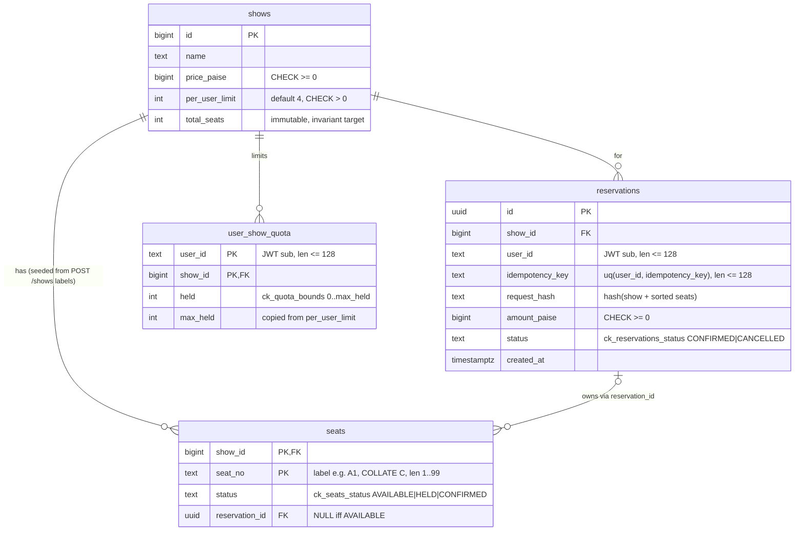

# ER diagram (IMS-29)

Lock order (reserve and cancel): `reservations` (idempotency) → `user_show_quota` → `seats`.
`user_show_quota.user_id` and `reservations.user_id` are plain JWT subs, with no users table.
Cancel updates seats in place (status → AVAILABLE, reservation_id → NULL); seat history is not kept.
A same-key replay after cancel cannot return the original seat list; behaviour to be documented in README.
